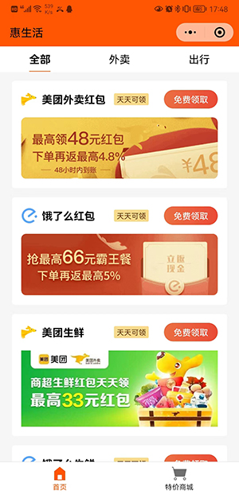
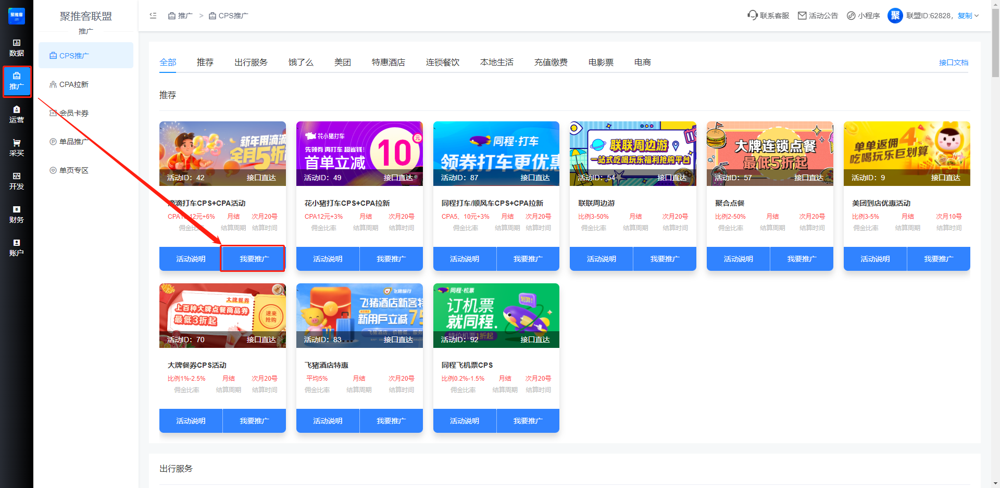
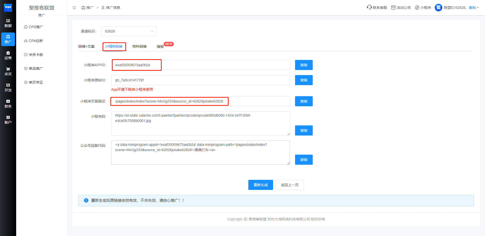
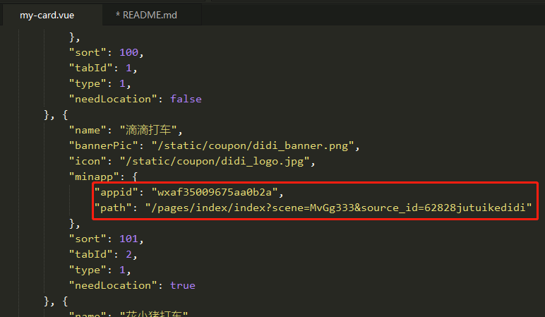

# 惠生活 benefiting-life

#### 介绍
程序员技术变现实例01 - 基于uni-app开发的cps小程序。  
助力程序员发展副业，实现税后收入。  

#### 软件架构
开发工具 HBuilderX 微信开发者工具  

#### 部署流程
##### 1. 下载HBuilderX 以及 微信开发者工具
HBuilderX下载地址: [HBuilderX](https://www.dcloud.io/hbuilderx.html)  
微信开发者工具下载地址: [微信开发者工具](https://developers.weixin.qq.com/miniprogram/dev/devtools/download.html)  
##### 2. 注册聚推客联盟账号，便于获取cps活动
推荐微信扫描下面的二维码进行注册：  

##### 3. 注册微信小程序
微信小程序注册地址：[微信小程序注册](https://mp.weixin.qq.com/wxopen/waregister?action=step1)  
由于我们的小程序不涉及支付，所以选择个人小程序即可。  
具体注册流程，可以看下官方文档[微信小程序注册流程](https://developers.weixin.qq.com/miniprogram/dev/framework/quickstart/getstart.html#%E7%94%B3%E8%AF%B7%E5%B8%90%E5%8F%B7)  
注册完成后，登录小程序后台，在菜单 “开发”-“开发设置” 获取小程序的 AppID，后面有用。  
##### 4. 克隆代码到本地，用HBuilderX打开
##### 5. 配置开发工具和项目内容
启动HBuilderX，点击 菜单"工具"-"设置"-"运行配置"，找到"小程序运行配置"-"微信开发者工具路径"，填入你的微信开发者工具安装地址即可。  
启动微信开发者工具，点击右上角的设置图标-安全-开启服务端口。  
打开项目根目录下的manifest.json，找到"微信小程序配置"，填入刚注册的微信小程序AppID。  
##### 6. 试运行  
点击 菜单"运行"-"运行到小程序模拟器"-"微信开发者工具", 等待微信开发者工具启动。  
至此，项目配置完成。  
##### 7. 修改cps活动内容  
cps活动内容我配置在components/my-card/my-card.vue下的coupons属性，你可以根据我的内容格式自行添加修改。  
在聚推客cps推广中，找到你想要的活动  
  
在弹出的渠道选择界面，随便建立一个渠道，然后选择渠道获取链接。  
然后获取推广的活动的AppId和小程序页面路径，并填入coupons。  
  
  
保存修改，同时运行到微信小程序即可。  
##### 8. 微信小程序发布  
在微信开发者工具中，点击界面右上角的上传，填入版本号和项目备注，点击上传。  
进入小程序后台，点击左侧版本管理，找到刚刚上传的版本，提交审核。  
等待审核通过后，点击发布即可。发布完成后即可获得小程序码，可以通过小程序码进入微信小程序。  
并通过分享的方式发送给朋友和朋友圈即可。  

#### 加我好友交流技术
